# ER 图

最后更新：2026-06-04

本 ER 图根据当前 `app/models.py` 整理。当前正式数据库是 Neon PostgreSQL，数据库结构由 SQLAlchemy models + Flask-Migrate / Alembic migrations 管理。

图片文件本体存储在 Cloudflare R2。图中的 `avatar`、`image`、`cover_image`、`image_path`、`document_path` 都是当前代码里的真实字段名；它们在生产语义上保存 URL / object key，不表示生产环境保存本地文件路径。

## 实体与表名

| ER 实体 | SQLAlchemy 模型 | 数据库表名 |
|---|---|---|
| `USER` | `User` | `user` |
| `ACTIVITY` | `Activity` | `activity` |
| `REGISTRATION` | `Registration` | `registration` |
| `ACTIVITY_FAVORITE` | `ActivityFavorite` | `activity_favorite` |
| `CIRCLE` | `Circle` | `circle` |
| `CIRCLE_MEMBER` | `CircleMember` | `circle_member` |
| `POST` | `Post` | `post` |
| `POST_IMAGE` | `PostImage` | `post_image` |
| `COMMENT` | `Comment` | `comment` |
| `COMMENT_IMAGE` | `CommentImage` | `comment_image` |
| `INTERACTION` | `Interaction` | `interaction` |
| `REVIEW` | `Review` | `review` |
| `ACTIVITY_REVIEW` | `ActivityReview` | `activity_review` |
| `USER_REVIEW` | `UserReview` | `user_review` |
| `TRUST_SCORE_LOG` | `TrustScoreLog` | `trust_score_log` |
| `PROFILE_VISIBILITY` | `ProfileVisibility` | `profile_visibility` |
| `USER_FOLLOW` | `UserFollow` | `user_follow` |
| `DIRECT_MESSAGE` | `DirectMessage` | `direct_message` |
| `DIRECT_MESSAGE_CONVERSATION_STATE` | `DirectMessageConversationState` | `direct_message_conversation_state` |
| `NOTIFICATION` | `Notification` | `notification` |
| `EMAIL_VERIFICATION_CODE` | `EmailVerificationCode` | `email_verification_code` |
| `MERCHANT_VERIFICATION` | `MerchantVerification` | `merchant_verification` |
| `ADMIN_LOG` | `AdminLog` | `admin_log` |

```mermaid
erDiagram
    USER ||--o{ ACTIVITY : organizes
    USER ||--o{ REGISTRATION : registers
    ACTIVITY ||--o{ REGISTRATION : has
    USER ||--o{ ACTIVITY_FAVORITE : favorites
    ACTIVITY ||--o{ ACTIVITY_FAVORITE : favorited_by
    CIRCLE ||--o{ ACTIVITY : links

    USER ||--o{ CIRCLE : owns
    CIRCLE ||--o{ CIRCLE_MEMBER : has
    USER ||--o{ CIRCLE_MEMBER : joins
    CIRCLE ||--o{ POST : contains
    USER ||--o{ POST : writes
    POST ||--o{ POST_IMAGE : has
    CIRCLE ||--o| POST : pins

    USER ||--o{ COMMENT : writes
    ACTIVITY ||--o{ COMMENT : receives
    POST ||--o{ COMMENT : receives
    COMMENT ||--o{ COMMENT : replies
    COMMENT ||--o{ COMMENT_IMAGE : has

    USER ||--o{ INTERACTION : performs
    USER ||--o| PROFILE_VISIBILITY : configures

    ACTIVITY ||--o{ REVIEW : legacy_reviews
    USER ||--o{ REVIEW : writes
    ACTIVITY ||--o{ ACTIVITY_REVIEW : receives
    USER ||--o{ ACTIVITY_REVIEW : writes
    ACTIVITY ||--o{ USER_REVIEW : context
    USER ||--o{ USER_REVIEW : gives
    USER ||--o{ USER_REVIEW : receives
    USER ||--o{ TRUST_SCORE_LOG : has
    USER ||--o{ TRUST_SCORE_LOG : changes

    USER ||--o{ EMAIL_VERIFICATION_CODE : owns
    USER ||--o{ NOTIFICATION : receives
    USER ||--o{ DIRECT_MESSAGE : sends
    USER ||--o{ DIRECT_MESSAGE : receives
    USER ||--o{ DIRECT_MESSAGE_CONVERSATION_STATE : owns_state
    USER ||--o{ DIRECT_MESSAGE_CONVERSATION_STATE : peer_state
    USER ||--o{ USER_FOLLOW : follows
    USER ||--o{ USER_FOLLOW : followed_by
    USER ||--o{ MERCHANT_VERIFICATION : applies
    USER ||--o{ MERCHANT_VERIFICATION : reviews
    USER ||--o{ ADMIN_LOG : writes

    USER {
        int id PK
        string username UK
        string nickname
        string email UK
        datetime email_verified_at
        string password
        string avatar
        text bio
        text interests
        string city
        boolean nearby_enabled
        string detected_city
        string detected_region
        datetime last_location_detected_at
        string last_ip
        string role
        int trust_score
        string status
        datetime banned_at
        datetime deleted_at
        datetime created_at
    }

    ACTIVITY {
        int id PK
        string title
        text description
        text detail
        string city
        string location
        datetime start_time
        datetime end_time
        string timezone
        int max_participants
        int initial_participants
        string image
        float fee
        text tags
        int circle_id FK
        string status
        text cancel_reason
        datetime cancelled_at
        boolean is_featured
        boolean is_official
        datetime created_at
        int organizer_id FK
        text preparation
    }

    REGISTRATION {
        int id PK
        int user_id FK
        int activity_id FK
        string status
        text cancel_reason
        datetime cancelled_at
        datetime register_time
    }

    ACTIVITY_FAVORITE {
        int id PK
        int user_id FK
        int activity_id FK
        datetime created_at
    }

    CIRCLE {
        int id PK
        string name
        string tag
        string cover_image
        text description
        text announcement
        int owner_id FK
        int pinned_post_id FK
        boolean is_pinned
        datetime pinned_at
        boolean is_system
        int initial_member_count
        int member_count
        string status
        datetime created_at
        datetime updated_at
    }

    CIRCLE_MEMBER {
        int id PK
        int circle_id FK
        int user_id FK
        string role
        string status
        datetime joined_at
        datetime updated_at
    }

    POST {
        int id PK
        string title
        text content
        string type
        string status
        datetime created_at
        int user_id FK
        int circle_id FK
    }

    POST_IMAGE {
        int id PK
        int post_id FK
        string image_path
        datetime created_at
    }

    COMMENT {
        int id PK
        int author_id FK
        int activity_id FK
        int post_id FK
        int parent_id FK
        text content
        string status
        datetime created_at
        datetime updated_at
    }

    COMMENT_IMAGE {
        int id PK
        int comment_id FK
        string image_path
        datetime created_at
    }

    INTERACTION {
        int id PK
        int user_id FK
        string target_type
        int target_id
        string action_type
        datetime created_at
    }

    REVIEW {
        int id PK
        int activity_id FK
        int user_id FK
        int rating
        text comment
        datetime created_at
    }

    ACTIVITY_REVIEW {
        int id PK
        int activity_id FK
        int reviewer_id FK
        int organization_score
        int venue_score
        int content_score
        int value_score
        int experience_score
        float average_score
        text comment
        string status
        datetime created_at
        datetime updated_at
    }

    USER_REVIEW {
        int id PK
        int activity_id FK
        int reviewer_id FK
        int reviewee_id FK
        int punctuality_score
        int friendliness_score
        int communication_score
        int reliability_score
        int respect_score
        int safety_score
        float average_score
        text comment
        string status
        datetime created_at
        datetime updated_at
    }

    TRUST_SCORE_LOG {
        int id PK
        int user_id FK
        int changed_by_id FK
        string change_type
        int delta
        int score_before
        int score_after
        text reason
        string related_type
        int related_id
        datetime created_at
    }

    PROFILE_VISIBILITY {
        int id PK
        int user_id FK
        string profile_scope
        string activity_scope
        string circle_scope
        string review_scope
        string trust_score_scope
        boolean show_interests
        boolean show_interactions
        datetime created_at
        datetime updated_at
    }

    USER_FOLLOW {
        int id PK
        int follower_id FK
        int followed_id FK
        datetime created_at
    }

    DIRECT_MESSAGE {
        int id PK
        int sender_id FK
        int recipient_id FK
        text content
        string message_type
        string image_path
        datetime read_at
        datetime expires_at
        datetime created_at
    }

    DIRECT_MESSAGE_CONVERSATION_STATE {
        int id PK
        int user_id FK
        int other_user_id FK
        boolean is_hidden
        datetime hidden_at
        boolean is_deleted
        datetime deleted_at
        datetime cleared_at
        datetime updated_at
    }

    NOTIFICATION {
        int id PK
        int recipient_id FK
        string type
        string title
        text content
        string related_type
        int related_id
        datetime read_at
        datetime expires_at
        datetime created_at
    }

    EMAIL_VERIFICATION_CODE {
        int id PK
        int user_id FK
        string email
        string code
        string purpose
        datetime expires_at
        datetime used_at
        datetime created_at
    }

    MERCHANT_VERIFICATION {
        int id PK
        int user_id FK
        string business_name
        string license_number
        string document_path
        text reason
        string contact
        string status
        text reject_reason
        int reviewer_id FK
        datetime reviewed_at
        datetime created_at
        datetime updated_at
    }

    ADMIN_LOG {
        int id PK
        int admin_id FK
        string action
        string target_type
        int target_id
        text detail
        string ip_address
        datetime created_at
    }
```

## 说明

- 当前没有名为 `Rating` 的模型；评分由 `Review`、`ActivityReview` 和 `UserReview` 共同承担。
- `Interaction.target_type` / `target_id` 和 `Notification.related_type` / `related_id` 是通用引用，不是数据库外键。
- `Comment` 通过检查约束限制评论目标必须且只能是一个活动或一个帖子。
- `docs/screenshots/er-diagram.png` 保留为历史截图；当前事实来源以本文和 [er-diagram.mmd](er-diagram.mmd) 为准。
